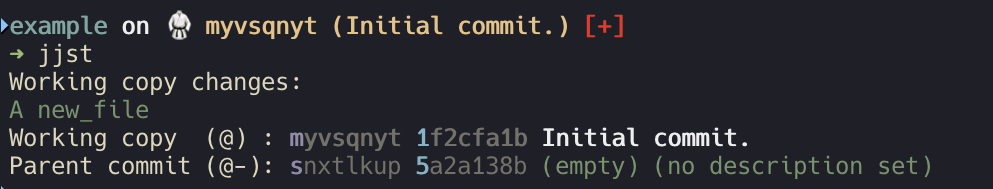

<h1 align="center">
  🥋 + 🚀
  <br>Spaceship JJ<br>
</h1>

<h4 align="center">
  A <a href="https://www.jj-vcs.dev/latest/" target="_blank">Jujutsu</a> section for the Spaceship prompt (tested with Jujutsu v0.40.0).
</h4>

<p align="center">
  <a href="https://github.com/lucean/spaceship-jj/releases">
    
  </a>

  <a href="https://github.com/lucean/spaceship-jj/actions">
    
  </a>
</p>

<p align="center">
  
</p>

## Overview

The `spaceship-jj` plugin is designed as a drop-in replacement for the Spaceship `git` section for use within Jujutsu repositories.
It currently supports displaying the following information:

* current change ID.
* description, with an option to show/hide the description if it is unset, and an option to truncate long descriptions.
* git commit ID, truncated to the first 8 characters with an option to view the full commit ID
* nearest bookmarked ancestor, with an indication of how far the current working copy is ahead of the nearest bookmark.
* status flags for files in the current working copy.

These individual components can be toggled on or off, as required.

## Installing

You need to source this plugin somewhere in your dotfiles. Here's how to do it with some popular tools:

### [Oh-My-Zsh]

Execute this command to clone this repo into Oh-My-Zsh plugin's folder:

```zsh
git clone https://github.com/lucean/spaceship-jj.git $ZSH_CUSTOM/plugins/spaceship-jj
```

Include `spaceship-jj` in Oh-My-Zsh plugins list:

```zsh
plugins=(... spaceship-jj)
```

### [zplug]

```zsh
zplug "lucean/spaceship-jj"
```

### [antigen]

```zsh
antigen bundle "lucean/spaceship-jj"
```

### [antibody]

```zsh
antibody bundle "lucean/spaceship-jj"
```

### [zinit]

```zsh
zinit light "lucean/spaceship-jj"
```

### [zgen]

```zsh
zgen load "lucean/spaceship-jj"
```

### [sheldon]

```toml
[plugins.spaceship-section]
github = "lucean/spaceship-jj"
```

### Manual

If none of the above methods works for you, you can install Spaceship manually.

1. Clone this repo somewhere, for example to `$HOME/.zsh/spaceship-jj`.
2. Source this section in your `~/.zshrc`.

### Example

```zsh
mkdir -p "$HOME/.zsh"
git clone --depth=1 https://github.com/lucean/spaceship-jj.git "$HOME/.zsh/spaceship-jj"
```

For initializing prompt system add this to your `.zshrc`:

```zsh title=".zshrc"
source "~/.zsh/spaceship-jj/spaceship-jj.plugin.zsh"
```

## Usage

After installing, add the following line to your `.zshrc` in order to include jj in the prompt:

```zsh
spaceship add --before git jj
```

Adding the section before the `git` section ensures that the `jj` section appears in a reasonable position relative to the other sections that may be active.

Alternatively, the above line can be added to `.config/spaceship.zsh`.

### Suppressing the Git section when using `jj`

Spaceship's `git` section is enabled by default. Because `jj` repositories are usually backed by git repositories internally, the git prompt will still appear alongside the `jj` prompt.
This can be resolved by setting `SPACESHIP_SHOW_GIT=false` in any repositories where `jj` is being used.
One way to do this is to use **direnv** to disable the git section automatically when entering those directories.

* Install `direnv`:

  ```bash
  # e.g. on macOS:
  brew install direnv
  ```

* Enable the direnv hook in zsh

  ```bash
  echo 'eval "$(direnv hook zsh)"' >> ~/.zshrc
  ```

* Reload your shell:

  ```bash
  exec zsh
  ```

* Create a `.envrc` file in your `jj` repository

  ```bash
  cd <path/to/jj_repository>
  echo 'export SPACESHIP_GIT_SHOW=false' > .envrc
  ```

* Allow direnv to load the environment

  ```bash
  direnv allow <path/to/jj_repository>
  ```

After this, the git sections will be hidden inside the `jj` repository.

* (Optional) Silence direnv load/unload messages

By default, direnv prints a message whenever an environment is loaded or unloaded. To suppress this:

```bash
cat <<'EOF' >> ~/.config/direnv/direnv.toml
[global]
log_filter = "^$"
EOF
```

## Options

This section is shown only in directories within a Jujutsu context.

### Main section

| Variable              |              Default               | Meaning                                        |
|:----------------------|:----------------------------------:|------------------------------------------------|
| `SPACESHIP_JJ_SHOW`   |               `true`               | Show current section                           |
| `SPACESHIP_JJ_ASYNC`  |               `true`               | Render section asynchronously                  |
| `SPACESHIP_JJ_PREFIX` |              `"on "`               | Prefix before section                          |
| `SPACESHIP_JJ_SUFFIX` |               `""`                 | Suffix after section                           |
| `SPACESHIP_JJ_SYMBOL` |               `🥋`                 | Symbol shown before the section content        |
| `SPACESHIP_JJ_ORDER`  | `(jj_desc jj_commit jj_bookmark jj_status)` | Order and inclusion of subsections  |

### Description (`jj_desc`)

Shows the change ID (shortest unique prefix) and description of the working copy commit.

| Variable                      |              Default               | Meaning                                   |
|:------------------------------|:----------------------------------:|-------------------------------------------|
| `SPACESHIP_JJ_DESC_SHOW`      |               `true`               | Show description subsection               |
| `SPACESHIP_JJ_DESC_EMPTY_SHOW`|              `false`               | Show `(empty)` label for empty commits    |
| `SPACESHIP_JJ_DESC_MAX_LENGTH`|              `999`                 | Maximum length of the description         |
| `SPACESHIP_JJ_DESC_ASYNC`     |               `true`               | Render subsection asynchronously          |
| `SPACESHIP_JJ_DESC_PREFIX`    | `$SPACESHIP_PROMPT_DEFAULT_PREFIX` | Prefix before subsection                  |
| `SPACESHIP_JJ_DESC_SUFFIX`    |               `" "`                | Suffix after subsection                   |
| `SPACESHIP_JJ_DESC_COLOR`     |             `"yellow"`             | Color of subsection                       |

### Commit ID (`jj_commit`)

Shows the commit ID of the working copy. Hidden by default - set `SPACESHIP_JJ_COMMIT_SHOW=true` to enable.

| Variable                       |   Default   | Meaning                              |
|:-------------------------------|:-----------:|--------------------------------------|
| `SPACESHIP_JJ_COMMIT_SHOW`     |   `false`   | Show commit ID subsection            |
| `SPACESHIP_JJ_COMMIT_FULL`     |   `false`   | Show full commit ID instead of first 8 characters |
| `SPACESHIP_JJ_COMMIT_ASYNC`    |   `true`    | Render subsection asynchronously     |
| `SPACESHIP_JJ_COMMIT_PREFIX`   |    `""`     | Prefix before subsection             |
| `SPACESHIP_JJ_COMMIT_SUFFIX`   |    `" "`    | Suffix after subsection              |
| `SPACESHIP_JJ_COMMIT_COLOR`    | `"magenta"` | Color of subsection                  |

### Bookmark (`jj_bookmark`)

Shows the nearest bookmark that is an ancestor of the working copy, along with it's position relative to the working copy using jj revset notation. For example, `(main @-)` means the `main` bookmark is one commit behind the working copy. If multiple bookmarks are equidistant, the count is shown instead, e.g. `(<2 bookmarks> @-)`.

| Variable                        |  Default  | Meaning                              |
|:--------------------------------|:---------:|--------------------------------------|
| `SPACESHIP_JJ_BOOKMARK_SHOW`    |  `true`   | Show bookmark subsection             |
| `SPACESHIP_JJ_BOOKMARK_ASYNC`   |  `true`   | Render subsection asynchronously     |
| `SPACESHIP_JJ_BOOKMARK_PREFIX`  |   `""`    | Prefix before subsection             |
| `SPACESHIP_JJ_BOOKMARK_SUFFIX`  |  `" "`    | Suffix after subsection              |
| `SPACESHIP_JJ_BOOKMARK_COLOR`   | `"blue"`  | Color of subsection                  |

### Status (`jj_status`)

Shows the working copy status as a string of symbols inside `[...]`. Hidden when the working copy is clean.

| Variable                          |  Default  | Meaning                              |
|:----------------------------------|:---------:|--------------------------------------|
| `SPACESHIP_JJ_STATUS_SHOW`        |  `true`   | Show status subsection               |
| `SPACESHIP_JJ_STATUS_COLOR`       |  `"red"`  | Color of subsection                  |
| `SPACESHIP_JJ_STATUS_PREFIX`      |   `""`    | Prefix before subsection             |
| `SPACESHIP_JJ_STATUS_SUFFIX`      |  `" "`    | Suffix after subsection              |
| `SPACESHIP_JJ_STATUS_ADDED`       |   `"+"`   | Symbol for added files               |
| `SPACESHIP_JJ_STATUS_MODIFIED`    |   `"!"`   | Symbol for modified files            |
| `SPACESHIP_JJ_STATUS_RENAMED`     |   `"»"`   | Symbol for renamed files             |
| `SPACESHIP_JJ_STATUS_DELETED`     |   `"✘"`   | Symbol for deleted files             |
| `SPACESHIP_JJ_STATUS_COPIED`      |   `"⊕"`   | Symbol for copied files              |
| `SPACESHIP_JJ_STATUS_CONFLICTED`  |   `"="`   | Symbol for conflicts                 |

## Contributing

First, thanks for your interest in contributing!

Contribute to this repo by submitting a pull request.

## License

MIT © [lucean](http://github.com/lucean)

<!-- References -->

[Oh-My-Zsh]: https://ohmyz.sh/
[zplug]: https://github.com/zplug/zplug
[antigen]: https://antigen.sharats.me/
[antibody]: https://getantibody.github.io/
[zinit]: https://github.com/zdharma/zinit
[zgen]: https://github.com/tarjoilija/zgen
[sheldon]: https://sheldon.cli.rs/
